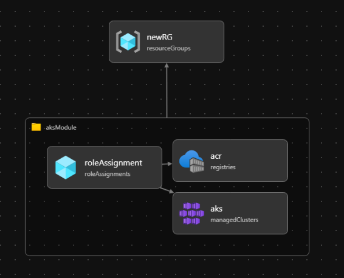

## Setting up infrastructure

We are using bicep to setup the infrastructure. The bicep files can be found under Infrastructure/Bicep folder.

To generate a public-private key pair to connect to the nodes if necessary, you can use the following command:
```
ssh-keygen -t rsa -b 4096 -f aks_key
```




## Login to Azure
```
az login
az account set --subscription b822363d-6075-4596-987a-1f24bce600dd
```

## Executing the bicep commands:

```
az deployment sub create --location westeurope --template-file main.bicep
```

## Attach ACR to AKS (Has to be merged with IaC)

For some reasons Bicep fails to connet ACR to AKS. Run the following to connect these two:

```
az aks update -n <AKS_CLUSTER_NAME> -g <RESOURCE_GROUP> --attach-acr <ACR_NAME>
az aks update -n aks101cluster -g CertificateIssuer101 --attach-acr aks101acr
```

## Connect to kubernetes cluster
```
az aks get-credentials --resource-group CertificateIssuer101 --name aks101cluster --overwrite-existing
```

## Containerize application

## Push applicaiton to ACR

## K9S commands

## Deploy dotnet application 
For migrating any changes to the database run the migraiton commands:

```
dotnet ef migrations add InitialCreate
dotnet ef database update
```

### Create necessary kubernetes resources including namespace to deploy the application to, deployments and services.

1. Create a new namespace
```
kubectl create namespace dotnet-application
```

2. Create a configMap: config map is being used for setting the environemnt variables. 
**NOTE: Sensitive data must be saved in K8S secrets.** (currently we are not setting this secrets)
```
apiVersion: v1
kind: ConfigMap
metadata:
  name: postgres-envs
  namespace: dotnet-application
  labels:
    app: postgres
data:
  POSTGRES_DB: ps_db
  POSTGRES_USER: ps_user
  POSTGRES_PASSWORD: SecurePassword123
```

2.2 Apply the config map in a particuler name-space
```
kubectl apply -f postgres.configMap.yml -n dotnet-application
```

2.3 Get all the config maps for a name-space:
```
kubectl get configmap -n dotnet-application
```

2.4 in case if you want to delete the config map let`s use the command below:
```
kubectl delete configmap postgres-secret -n dotnet-application
```

We need to keep the storages and share the database data to another external volume. 
- So we updated our bicep to create a Azure Managed Disk (the code exist in aks.bicep file)

(we assigned the role management manually to assign the contributor role on Azure Managed Disk )

Then created files for 
** postgres.pv ** 
** postgres.pvc ** 
** postgres.statefulset **


Apply Pv file to apply persistance Volume already created using bicep 
```
kubectl apply -f postgres.pv.yml
```

Apply PVC file 
```
kubectl apply -f postgres.pvc.yml -n dotnet-application
```

Apply Stateful
```
kubectl apply -f postgres.statefulset.yml -n dotnet-application
```


3- Create a deployment file:
```
apiVersion: apps/v1
kind: Deployment
metadata:
  name: razor-app
  namespace: dotnet-application
spec:
  replicas: 1
  selector: 
    matchLabels:
      app: razor-app
  strategy:
    type: RollingUpdate
    rollingUpdate:
      maxSurge: 1
      maxUnavailable: 1
  minReadySeconds: 5 
  template:
    metadata:
      labels:
        app: razor-app
    spec:
      nodeSelector:
        "kubernetes.io/os": linux
      serviceAccountName: default
      containers:
        - name: razor-app
          image: aks101acr.azurecr.io/aks-app1:1.0.0
          imagePullPolicy: Always
          ports:
            - name: http
              containerPort: 80
              protocol: TCP
```
3.2. Apply the deployment file:
```
kubectl apply -f deployment.yml -n dotnet-application
```

Note: In case you need to delete a deployment, use:
```
kubectl delete -f deployment.yml -n dotnet-application
```

4. Create a service
```
apiVersion: v1
kind: Service
metadata:
  name: razor-app
  namespace: dotnet-application
  labels: {}
spec:
  type: ClusterIP #LoadBalancer
  ports:
    - port: 80
      targetPort: 80
      protocol: TCP
      name: http
  selector: 
    app: razor-app
```

Apply the changes:

```
kubectl apply -f service.yml -n dotnet-application
```

Note: In case to delete a service, use:

```
kubectl delete -f deployment.yml -n dotnet-application
```

## Helm
After everything is created directly by using kubernetes API server, we can start using helm. 

Helm is a package maanger that packages all the resource definitions into one chart, and facilitate creation of all the dependent resources together. This makes versioning and rollback much easier. As everything will run with only one command, the whole implementation is considerably faster and less error-proned.

1. In order to create a helm chart run the following command:

```
helm create chart_name
helm create postgres
```

This will automatically create the following structure:

```
postgres/
├── charts/
├── templates/
│   ├── deployment.yaml
│   ├── service.yaml
│   ├── statefulset.yaml
│   ├── pvc.yaml
│   └── _helpers.tpl
├── Chart.yaml
└── values.yaml
```

2. For each f teh resources, setup the correct values in values.yml. As an example the following pv.yaml will translate into the corresponding values.yml:

```
apiVersion: v1
kind: PersistentVolume
metadata:
  name: postgres-volume
  labels:
    type: local
    app: postgres
spec:
  storageClassName: "" #managed-csi
  capacity:
    storage: 8Gi
  accessModes:
    - ReadWriteOnce
  azureDisk:
    kind: Managed
    diskName: pg-disk
    diskURI: "/subscriptions/b822363d-6075-4596-987a-1f24bce600dd/resourceGroups/CertificateIssuer101/providers/Microsoft.Compute/disks/pg-disk"
```

values.yml:
```
PersistentVolume:  
  name: postgres-volume
  labels:
    type: local
    app: postgres
  storageClassName: ""
  capacity: 8Gi
  accessModes: 
    - ReadWriteOnce
  azureDisk:
    Kind: Managed 
    diskName: pg-disk
    diskURI: "/subscriptions/b822363d-6075-4596-987a-1f24bce600dd/resourceGroups/CertificateIssuer101/providers/Microsoft.Compute/disks/pg-disk"
```

3. Then adopt the pv.yml in the template folder by using the values.yml:

```
apiVersion: v1
kind: PersistentVolume
metadata:
  name: {{ .Values.persistentVolume.name }}
  labels:
    type: {{ .Values.persistentVolume.labels.type }}
    app: {{ .Values.persistentVolume.labels.postgres }}
spec:
  storageClassName: {{.values.persistentVolume.storageClassName }}
  capacity:
    storage: {{ .Values.persistentVolume.capacity }}
  accessModes: {{ .Values.persistentVolume.accessModes }}
  azureDisk:
    kind: {{ .Values.persistentVolume.azureDisk.kind }}
    diskName: {{ .Values.persistentVolume.azureDisk.diskName }}
    diskURI: {{ .Values.persistentVolume.azureDisk.diskURI }}
```

4. Check at client if the helm chart is correctly formed:

```
helm template .\postgres\ 
```

After everything is setup, install the chart by giving it a name, run the following command on the root folder where postgres chart resides.:

```
helm install postgres-package ./postgres -n dotnet-application
```

If the command runs successfully, you'll see the following:
```
NAME: postgres-package
LAST DEPLOYED: Sun May 11 02:12:41 2025
NAMESPACE: dotnet-application
STATUS: deployed
REVISION: 1
TEST SUITE: None
```

In case we need to rollback, we can run the following command:

```
helm rollback postgres-package 1 -n dotnet-application
```

4. Use helm template to check the template you have built is valid:
```
helm template .\postgres\
```

Note: To uninstall a package, run the following command:

```
helm uninstall postgres-package -n dotnet-application
```

To debug run the following commands to check if container has started or what is preventing it from starting:

```
kubectl logs postgres-0 -n dotnet-application -c volume-permissions
helm uninstall postgres-package -n dotnet-application
helm install postgres-package ./postgres -n dotnet-application
kubectl get pods -n dotnet-application

# Confirm the disk is accessible and not in a failed state using Azure CLI:
az disk show --name <your-disk-name> --resource-group <your-resource-group>
az disk show --name pg-disk --resource-group CertificateIssuer101 

# Resource Limits: Ensure the node has enough CPU/memory:
kubectl describe node <node-name>

# Test the Command: If possible, exec into the init container (if it’s running but not completing):
kubectl exec -it postgres-0 -n dotnet-application -c volume-permissions -- sh

kubectl logs postgres-0 -n dotnet-application -c volume-permissions
kubectl logs postgres-0 -n dotnet-application -c postgres
```

**Note:Remember, YAML keys are case-sensitive!**

## Setting up cert-manage on K8S

cert-manager is a powerful and extensible X.509 certificate controller for Kubernetes and OpenShift workloads. It will obtain certificates from a variety of Issuers, both popular public Issuers as well as private Issuers, and ensure the certificates are valid and up-to-date, and will attempt to renew certificates at a configured time before expiry.

1. Setup the right powershell flags/environment variables:
```
Set-ExecutionPolicy Bypass -Scope Process -Force; [System.Net.ServicePointManager]::SecurityProtocol = [System.Net.SecurityProtocolType]::Tls12; Invoke-Expression (New-Object System.Net.WebClient).DownloadString('https://community.chocolatey.org/install.ps1')
```
2. Install helm on your local machine using winget or choco (choco is recommended):
```
choco install kubernetes-helm
# or
winget install Helm
```
3. Install cert-manager helm repo:
```
helm repo add jetstack https://charts.jetstack.io --force-update
```

4. Install cert-manager:
```
helm install \
  cert-manager jetstack/cert-manager \
  --namespace cert-manager \
  --create-namespace \
  --version v1.17.0 \
  --set crds.enabled=true

helm install cert-manager jetstack/cert-manager --namespace cert-manager --create-namespace --version v1.17.0 --set crds.enabled=true
```

**Note:** Step 1 to 3 have to be applied once per machine.

## Read Kubernetes resources
```
kubectl get deployments --all-namespaces=true
kubectl get deployments --namespace <namespace-name>
kubectl describe deployment <deployment-name> --namespace <namespace-name>
kubectl logs -l <label-key>=<label-value>
kubectl logs -l app=razor-app -n dotnet-application
kubectl get all --all-namespaces=true
kubectl get all --namespace=dotnet-application
```

## Debugging
### Connecting to a running pod
```
kubectl exec -it <pod-name> -n dotnet-application -- netstat -tulpn
kubectl exec -it razor-app-7799bc6677-crn4c -n dotnet-application -- netstat -tulpn

```

## Selector and label naming

1. In deployment file spec.selector.matchLabels has to be same as spec.template.metadata.Labels

```
spec:
  replicas: 1
  selector: 
    matchLabels:
      app: razor-app
  strategy:
    type: RollingUpdate
    rollingUpdate:
      maxSurge: 1
      maxUnavailable: 1
  minReadySeconds: 5 
  template:
    metadata:
      labels:
        app: razor-app
```

2. In deployment file and service file must have the same label:

label in deployment

```
# deployment.yml
template:
  metadata:
    labels:
      app: razor-app-deployment-selector
```
Selector in service:
```
# servive.yml
selector:
  app: razor-app-service-selector
```

**Note**: CertificateIssuer which is a custome resource definition doesn't have a namespace, a so-called non-namespaced resource.

## To Dos

1. How to connect an ACR to K8S cluster?
2. How to deploy a razor page web app to K8S in a new namespace?
3. How to use the cert-manager to issue a certificate?
4. How does our application utilize the issued certificate?
5. Github workflows to automate build an push images into ACR by using dockerfile.
6. Replace the following line with bicep:
```
az aks update -n aks101cluster -g CertificateIssuer101 --attach-acr aks101acr
```
7. Make all AKS services private, and expose them via ingress or alternative solutions.
8. Create a keyvault with Bicep.
9. Create a bash script to sync certificates from AKS to keyvault.
10. K9S commands
11. Sensitive data must be saved in K8S secrets
12. In statefulset when we make more than 1 replica, does it horizontally scale postgres database?
13. ArgoCD
14. Add kubernetes managed identity to managed disk by using Bicep

